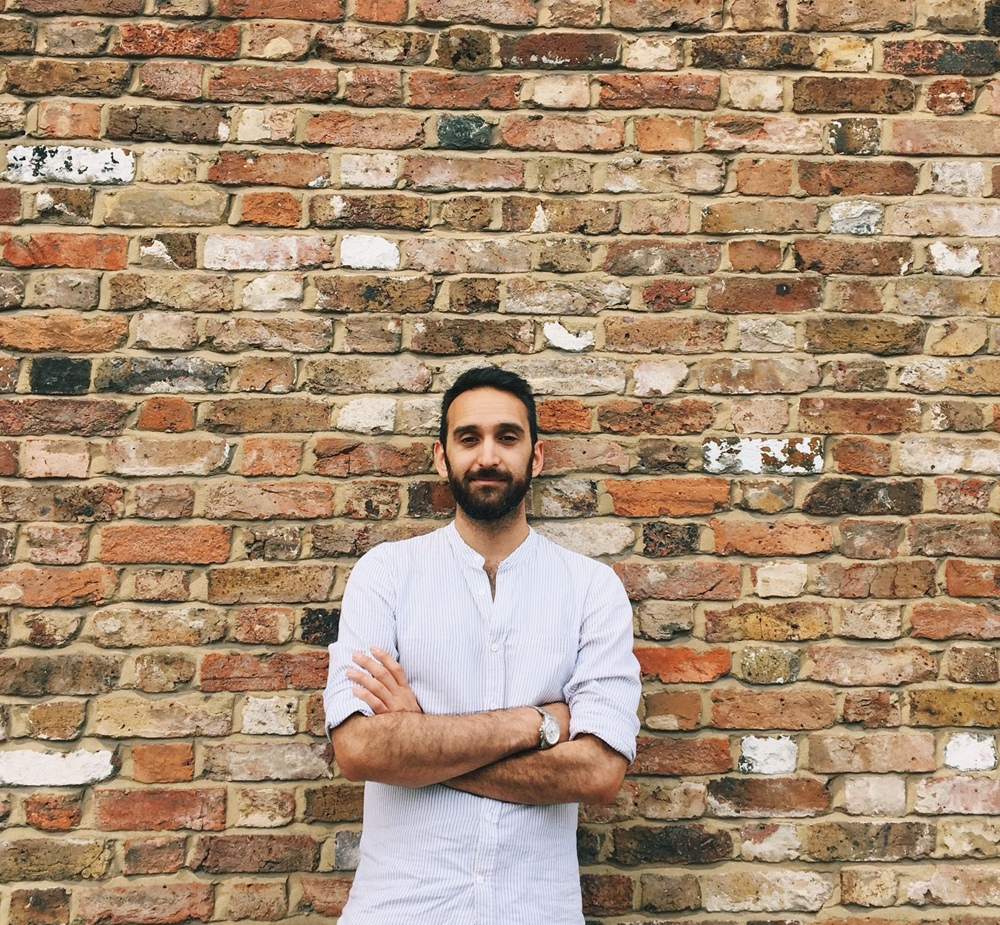
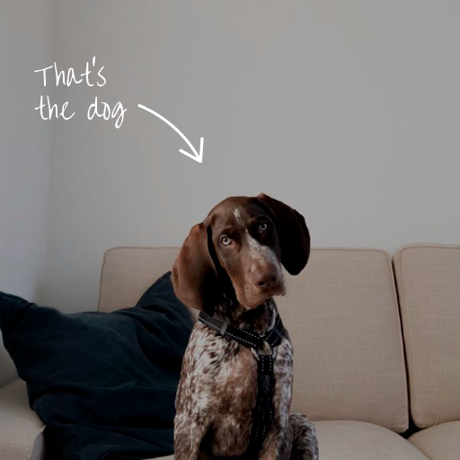

<style scoped> 
section{
    text-align: center;
}

h1, h2, h3{
    margin:0
}

</style>

# presentation title
*Sub title*

---
<!-- header: about me -->



- Building Engineer by Polytechnic University of Madrid
- Transitioned from BIM roles to Computational Designer and developer
- Full-stack developer at matterlab
- Advocate of open source and DIY
- Loves walking his dog

---



---

<!-- header: something else -->


---

<!-- 
_header: '' 
_paginate: false
-->

# agenda :book:

---
<!-- 
header: agenda
 -->

- Section 1
- Section 2
- Section 2

---
<!-- 
_header: ''
_paginate: false -->

# section 1 :rocket:

---
<!-- 
header: section 1
footer: subsection
 -->

**some content** // detail

---

```python
# Some code in python

for i in range(10):
    print(i)
```

---

> :bulb: A quote

---
<!-- 
_header: ''
_footer: ''
_paginate: false
 -->

 # challenge :pencil:

 ---

<!-- 
_header: challenge
_footer: ''
_paginate: false
 -->

### :pencil: challenge title
*Some description about the challenge*

---

<!-- 
header: ''
footer: ''
_paginate: false
 -->
 # break :coffee:
 *15min*


 ---
<!-- 
header: ''
footer: ''
_paginate: false
 -->
<style scoped> 
section{
    text-align: center;
}

h1, h2, h3{
    margin:0
}

</style>

# the end.
*thank you*:wave:
